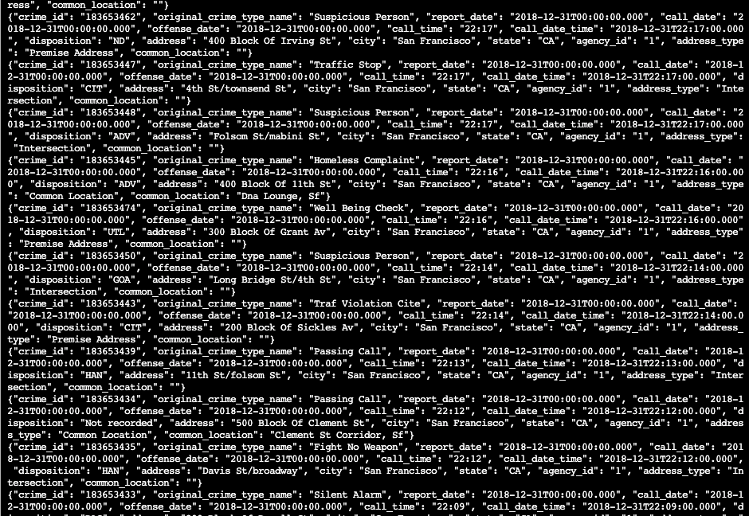
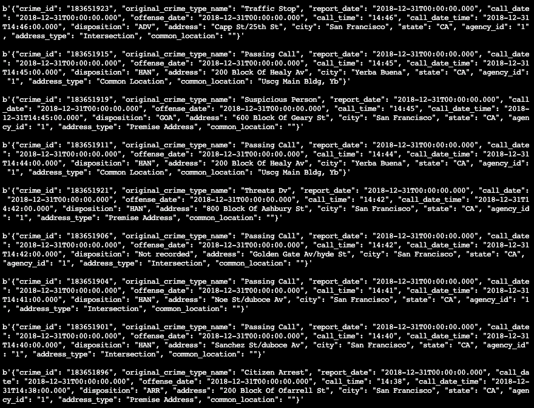
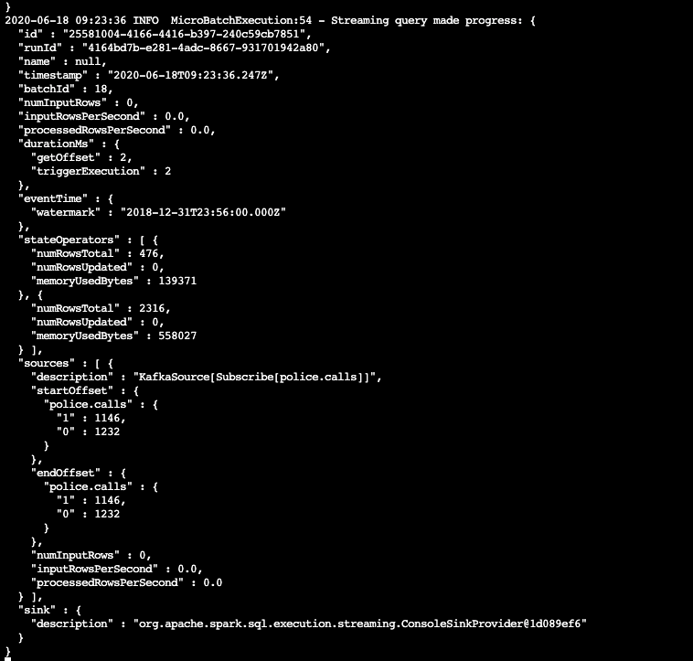
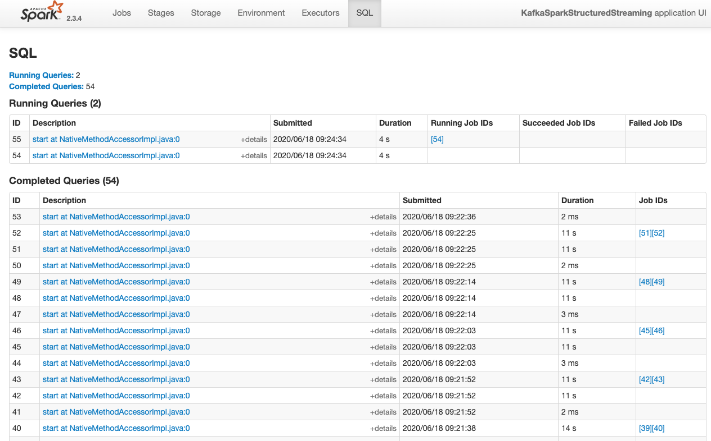

# Udacity Data Streaming Nanodegree project: San-Francisco Crime Statistics with Spark Streaming

## Introduction

This project demonstrates creation of a streaming application using Spark. Spark connects to Kafka topics to read and process data.

## Requirements

- Java 1.8
- Scala 2.11
- Kafka
- Spark 2.4
- Python 3.6+

## Start Zookeeper and Kafka

```bash
bin/zookeeper-server-start.sh config/zookeeper.properties
bin/kafka-server-start.sh config/server.properties
```

## Install packages

```bash
./start.sh
```

## Publish crime data to Kafka

```bash
python kafka_server.py
```

## Check if data is available at the topic

```bash
kafka-console-consumer --bootstrap-server localhost:9097 --topic police.calls --from-beginning
```

This should look like this:



## Use own consumer server to read the topic

```bash
python consumer_server.py
```

This should look like this:



## Run Spark Streaming application

```bash
spark-submit --packages org.apache.spark:spark-sql-kafka-0-10_2.11:2.3.4 --master local[*] data_stream.py
```

Batch Progress reporting logs:



Spark UI should look like this:




## Questions

* How did changing values on the SparkSession property parameters affect the throughput and latency of the data?

There is always a balance between latency and throughput that should be chosen in accordance with requirements. Ideally the data should be consumed as fast as it can be processed in Spark, and not slower that it appears at the source.

With an optimal configuration, the resulting aggregated data will appear with minimal latency, and the inbound flow processes effectively in batches.

Related configuration properties: `spark.streaming.backpressure`, `spark.streaming.receiver.maxRate`, `spark.streaming.kafka.maxRatePerPartition`, `spark.streaming.kafka.minRatePerPartition`.

* What were the 2-3 most efficient SparkSession property key/value pairs? Through testing multiple variations on values, how can you tell these were the most optimal?

Most efficient properties: `spark.default.parallelism`, `spark.streaming.kafka.maxRatePerPartition`.

We can check if the input data was balanced/unbalanced, skewed or not. We can check the throughput of each partition using Spark UI, and how many cores are consistently working.
